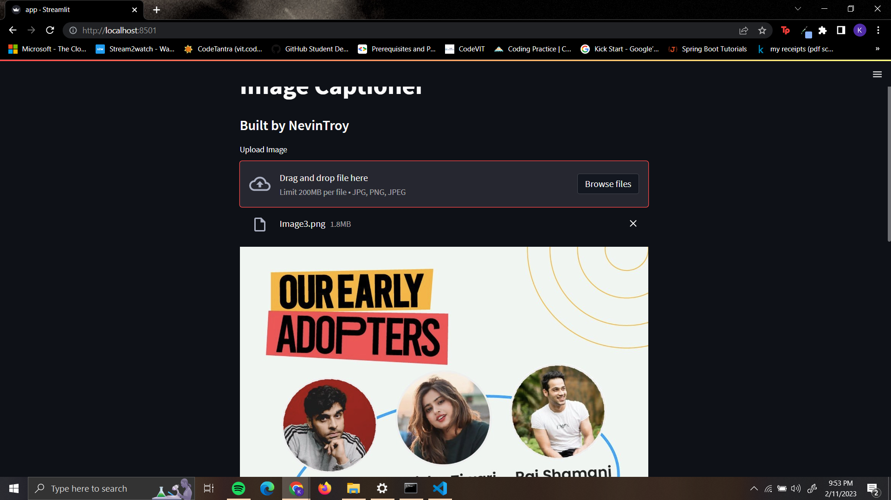
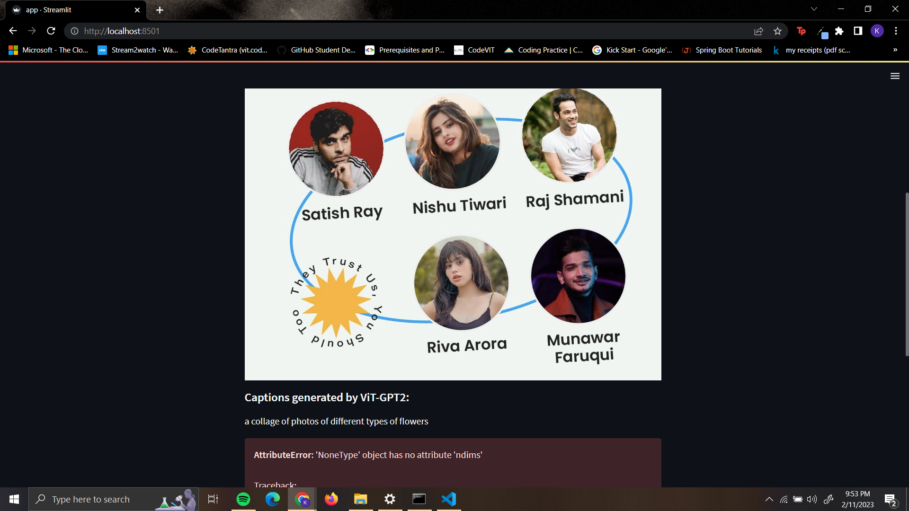

## 
 
The image captioning model was created using two architectures:
1. Inception V-Net + Transformers architecture
2. ViT + GPT2
Both these models are trained on 
The first one is a custom Encoder-Decoder Model that consists of the an Inception V Net Encoder and a Transformers Decoder. 
The second one is a pretrained ViT encoder and a GPT2 decoder. Due to system constraints, the pretrained model has been imported from huggingface.co

The second architecture provides better results but a caveat is that ViT architecture requires large amounts of images to be trained upon. 
To run the app, run 
```bash
  streamlit run app.py
```


Note: Make sure all the dependancies mentioned in requirements.txt are installed 
