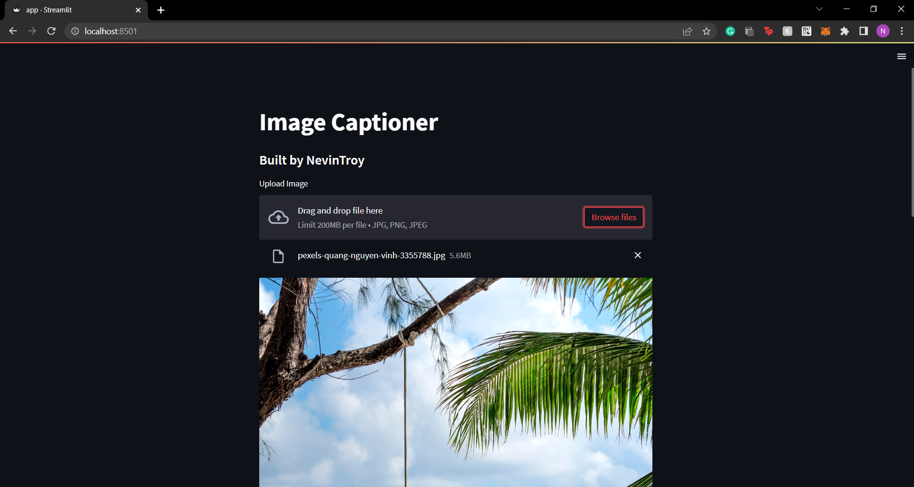
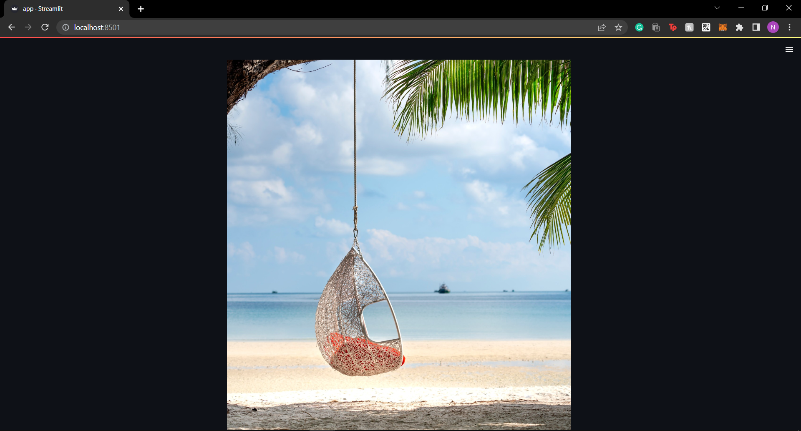
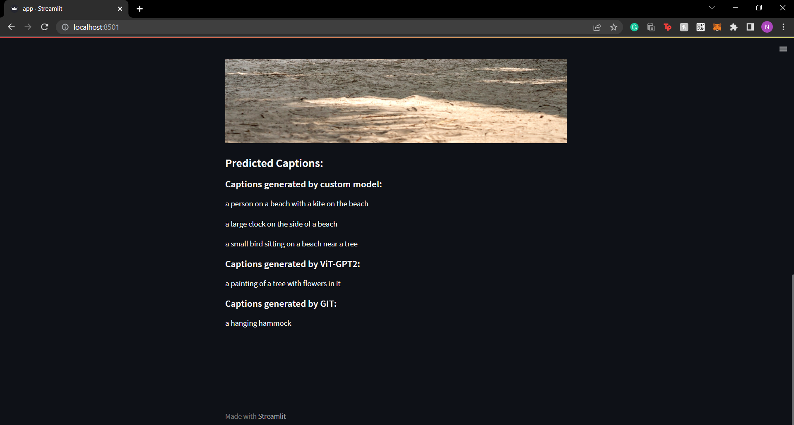

## 
 
The image captioning model was created using two architectures:
1. Inception V-Net + Transformers architecture
2. ViT + GPT2
3. GIT model

All these models are pretrained on COCO dataset
The models are the fine-tuned on [Instagram Caption Dataset](https://www.kaggle.com/datasets/prithvijaunjale/instagram-images-with-captions)
The first one is a custom Encoder-Decoder Model that consists of the an Inception V Net Encoder and a Transformers Decoder. 
The second one is a pretrained ViT encoder and a GPT2 decoder. 
The third one is a pretrained GIT Vision model and performs the best.

The third model performs the best amongst all three giving accurate results.

To run the app, run 
```bash
  streamlit run app.py
```



Note: Make sure all the dependancies mentioned in requirements.txt are installed 
